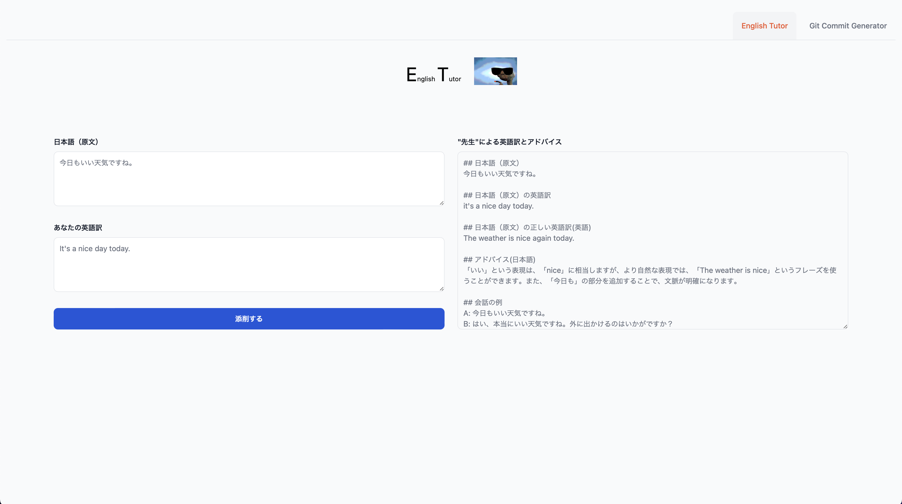
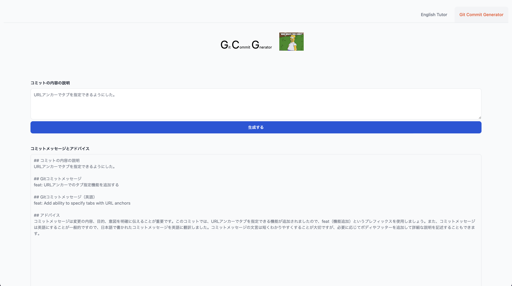

# AI Assistants🤖🤖

🤖 English Tutor

🤖 Git Commit Generator


Powered by OpenAI's Chatbot API.

## Developing

Once you've created a project and installed dependencies with `npm install` (or `pnpm install` or `yarn`), start a development server:

```bash
npm run dev

# or start the server and open the app in a new browser tab
npm run dev -- --open
```

### Environment Variables

You need to create `.env` file to run the app.
`.env.example` is a template for the file.
Beaware that you need to set `OPENAI_API_KEY` to run the app and the key is not included in the template.
Consult [OpenAI's help page](https://help.openai.com/en/articles/4936850-where-do-i-find-my-secret-api-key) to get the key.

## Building

To create a production version of your app:

```bash
npm run build
```

You can preview the production build with `npm run preview`.

> To deploy your app, you may need to install an [adapter](https://kit.svelte.dev/docs/adapters) for your target environment.
